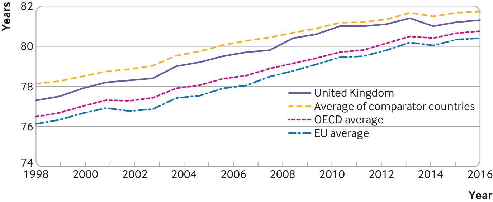

<!-- setup -->

```{r, include=FALSE}
knitr::opts_chunk$set(echo = TRUE)

```

```{r, library, include = FALSE}
library(scales)
library(tidyverse) # the usual stuff: dplyr, readr, and other goodies
library(lubridate)
library(ggmap)
library(ggrepel)
library(gridExtra)
library(pander)
library(here)
library(janitor)
library(skimr)
library(leaflet)
library(leaflet.extras)
library(tmap)
library(tmaptools)
library(hrbrthemes)
library(mapview)
library(viridis)
library(plotly)
library(ggtext)
library(GGally) # for correlation-scatter plot matrix
library(treemapify)
library(RColorBrewer)
library(extrafont)
library(ggThemeAssist)
library(sf)
library(rnaturalearth)
library(rnaturalearthdata)
library(vroom)
library(patchwork)
library(ggalt)
library(ggplot2)
```

```{r, them_function_and_palette, include = FALSE}
theme_nhs <- function() {
  font = "Helvetica"
  theme_minimal()
  theme(
    panel.grid = element_blank(), 
    panel.background = element_blank(), 
    axis.line = element_line(size = 0.5, colour = "grey80"), 
    # Remove legend
    legend.position = "none", 
    legend.key = element_rect(fill = "transparent"), 
    axis.text.x = element_text(color = "grey20", size = 10, family = font),
    axis.text.y = element_text(color = "grey20", size = 10, family = font),
    axis.title.x = element_text(color = "grey20", size = 12, angle = 0, 
                                hjust = .5, vjust = 0, family = font),
    axis.title.y = element_text(color = "grey20", size = 12, 
                                hjust = .5, vjust = .5, family = font), 
    plot.title = element_text(color = "grey20", size = 14, 
                              family = font, face="bold"), 
    legend.text = element_text(color = "grey20", size = 10, family = font), 
    legend.title = element_text(color = "grey20", size = 12, family = font)
  )
}
palette <- c('#235eb8', '#595dac', '#756f9f', '#8a8191', '#9c9481', '#aba771', '#b9bb5e', '#c6cf45', '#d1e41a')
two_color <- c('#235eb8', '#d1e41a')
```

<!-- setup -->

# Overview of Healthcare Spending

use indicator: healthcare spending per capita

Possible perspectives: 

- [Where does the NHS spend its money and what are the biggest costs](https://www.england.nhs.uk/costing-in-the-nhs/national-cost-collection/) 
- can also do cost per appointment/procedure? 
    - **following question** : how does the lower healthcare spending impact system performance > staff shortages

## Amelia@Country-wise comparison

```{r read data and clean it, warning=FALSE, message=FALSE}
#Current health expenditure (% of GDP) (Source: https://data.worldbank.org/indicator/SH.XPD.CHEX.GD.ZS)
wb_data <- read_csv("data/healthcare-spending/world_bank_data.csv") %>%
  clean_names()

skimr::skim(wb_data)

wb_data <- wb_data %>%
  remove_empty(which=c("rows", "cols"), quiet=FALSE)

# get time series data
wb2 <- wb_data %>%
  pivot_longer(cols=c("x2000", "x2001", "x2002", "x2003", "x2004", "x2005", "x2006", "x2007", "x2008", "x2009", "x2010", "x2011", "x2012", "x2013", "x2014", "x2015", "x2016", "x2017", "x2018", "x2019"),
               names_to="Year",
               values_to="Spending") %>% 
  mutate(Year = as.integer(substr(Year, 2, 5)))
head(wb2)
```

### Initial Visualisations

```{r visualisations, warning=FALSE, message=FALSE}

comparable_countries <- c("GBR", "BEL", "BGR", "CYP", "HRV", "CZE", "DNK", "EST", "FIN", "FRA", "DEU", "GRC", "HUN", "IRL", "ITA", "LVA", "LTU", "LUX", "MLT", "NLD", "POL", "PRT", "ROM", "SVK", "SVN", "ESP", "SWE")

wb2 %>%
  filter(country_code %in% comparable_countries) %>%
  mutate(is_gbr = ifelse(country_code=="GBR", 1, 0)) %>%
  group_by(is_gbr, Year) %>%
  summarize(spending_avg=mean(Spending, na.rm=TRUE)) %>%
  mutate(label = ifelse(Year != 2019, NA_character_, ifelse(is_gbr==1, "GBR", "Other"))) %>% 
  ggplot(aes(x=Year, y=spending_avg, color=as.factor(is_gbr))) + 
  geom_vline(
    xintercept = seq(1999, 2019, 1), color = "grey80", size = .4) + 
  geom_segment(
    data = tibble(y = seq(0, 11, 1), x1 = 1999, x2 = 2019),
    aes(x = x1, xend = x2, y = y, yend = y),
    inherit.aes = FALSE,
    color = "grey80",
    size = .4
  ) +
  geom_segment(
    data = tibble(y = 0, x1 = 1999, x2 = 2019),
    aes(x = x1, xend = x2, y = y, yend = y),
    inherit.aes = FALSE,
    color = "grey80",
    size = .4
  ) +
  geom_point() +
  geom_line() +
  labs(title = "Health Expenditure as % of GDP in EU countries compared vs the UK", 
       y = NULL, x = NULL, 
       caption = "Source: The World Bank (https://data.worldbank.org/indicator/SH.XPD.CHEX.GD.ZS)") + 
  theme_nhs() + 
  scale_x_continuous(breaks = seq(1999, 2019, 1), limits = c(1999, 2021), expand = c(0, 0)) + 
  scale_y_continuous(breaks = seq(0, 11, 1), labels = function(x) paste0(x, "%"), limits = c(0, 11)) + 
  theme(axis.text.x = element_text(angle=45, hjust = 1, vjust = 1), 
        axis.ticks = element_line(color = "grey80")) + 
  geom_text_repel(
    aes(color = as.factor(is_gbr), label = label),
    xlim = c(2019, NA),
    family = "Helvetica",
    fontface = "bold",
    size = 4, 
    segment.size = .7,
    segment.alpha = .5,
    segment.linetype = "dotted"
  ) + 
  scale_color_manual(values = c(palette[1], palette[7]))
```


## San@Breaking down the cost

Analysing the NHS costs. Would be interesting to see how that has also changed over time. Creating sth like this:


- Picture Source: [https://news.sky.com/nhs-in-numbers]

- Useful resources: [https://www.england.nhs.uk/costing-in-the-nhs/national-cost-collection/]

# Workforce of Healthcare

## Athos@Healthcare workforce in the history

Employees of the health and social care systems in history: 
- History vs today 2000-2019-today
- Brexit impact - sth like below about EU workers




## Drishti@Staff Shortages

[Staff shortages in which areas](https://news.sky.com/nhs-in-numbers)

- Exploring nationalities of NHS staff (by role e.g. doctor/nurse etc)
- Exploring in which areas there are biggest staff shortages 
    - How does that correspond to the nationalities? (The biggest shortages are for nurses - where do nurses - come from currently? Are a large number of them from the EU?)
- Graph source: [https://www.bma.org.uk/advice-and-support/nhs-delivery-and-workforce/workforce/nhs-medical-staffing-data-analysis]


## Amelia@Health workers salary change over the years vs inflation graph?

```{r, NHS Staff Earnings Estimates, warning=FALSE, message=FALSE}

# NHS Staff Earnings Estimates (Source: https://digital.nhs.uk/data-and-information/publications/statistical/nhs-staff-earnings-estimates)
nhs_salary <- read_csv("data/healthcare-spending/NHS Staff Annual Earnings Estimates to June 2022 in NHS Trusts and other core organisations in England, Provisional Statistics CSV text file.csv") %>%
  clean_names()

nhs_salary1 <- nhs_salary %>%
  filter((payment_type=="PUBGRP_020_EARNINGS") & (staff_group != "All staff")) %>%
  mutate(year = year(date)) %>%
  group_by(staff_group, year) %>%
  mutate(yearly_earnings=mean(amount)) %>%
  ggplot(aes(x=year, y=yearly_earnings, color=staff_group)) +
  geom_point() +
  geom_line() + 
  theme_nhs() + 
  theme(legend.position = "none", 
        panel.grid.major = element_line(color = "grey80"),  
        panel.grid.minor = element_line(color = "grey80"))
  
nhs_salary1 
```


```{r, Merge Average weekly earnings, warning=FALSE, message=FALSE}
#Average weekly earnings of people in the UK Whole Economy Level (£): Seasonally Adjusted Total Pay Excluding Arrears (Source: https://www.ons.gov.uk/employmentandlabourmarket/peopleinwork/earningsandworkinghours/timeseries/kab9/emp)
uk_salary <- read_csv("data/healthcare-spending/UK_salary.csv", skip=7)%>%
  clean_names() %>%
  filter(important_notes %in% c("2009", "2010", "2011", "2012", "2013", "2014", "2015", "2016", "2017", "2018", "2019", "2020", "2021")) %>%
  mutate(yearly_salary_uk=x2*52) %>%
  rename(year=important_notes) %>%
  summarize(year, yearly_salary_uk)

nhs_salary2 <- nhs_salary %>%
  filter(payment_type == "PUBGRP_020_EARNINGS",
         staff_group == "All staff") %>%
  mutate(year = year(date)) %>%
  group_by(year) %>%
  summarize(yearly_earnings=sum(amount)) %>%
  filter(year != "2022") %>%
  rename(yearly_earnings_nhs=yearly_earnings)

salary_data <- merge(uk_salary, nhs_salary2, by="year")

salary_data1 <- pivot_longer(salary_data,
             cols=2:3,
             names_to="type",
             values_to="yearly_salary")
```

```{r, nhs_v_avg_plot}
salary_data1 %>%
  ggplot(aes(x=year, y=yearly_salary, color=type)) +
  geom_point() + 
  theme_nhs() + 
  theme(legend.position = "none", 
        panel.grid.major = element_line(color = "grey80"),  
        panel.grid.minor = element_line(color = "grey80"))

```

```{r exploratory graphs}


```

# Mingyu@Patient Experience

Waiting list analysis. Would be super interesting to see what the highest wait times are and what they are for:

- Source: [https://www.bma.org.uk/advice-and-support/nhs-delivery-and-workforce/pressures/nhs-backlog-data-analysis]
- Data: [https://www.england.nhs.uk/statistics/statistical-work-areas/rtt-waiting-times/rtt-data-2020-21/]


## Data cleaning

```{r, load_clean_data_wl, warning=FALSE, message=FALSE}
# load data
wl <- read.csv("data/waiting_list/nhs_waiting_list_time_series.csv")

wl_ts <-wl %>% 
  pivot_longer(-month, names_to = "indicator", values_to = "value") %>% 
  separate(indicator, c("category", "index"), "_") %>% 
  mutate(category = str_replace_all(category, "\\.", "_"), 
         index = str_replace_all(str_replace_all(index, "\\.", "_"), 
                                 "__", "_")) %>% 
  mutate(index = if_else(str_detect(index, "_$"), 
                         substr(index, 1, nchar(index) - 1), index), 
         category = if_else(str_detect(category, "_$"), 
                            substr(category, 1, nchar(category) - 1), 
                            category)) %>% 
  mutate(index = if_else(str_detect(index, "No__"), 
                         str_replace(index, "No__", "Num_more_"), 
                         str_replace(index, "No", "Num"))) %>% 
  mutate(index = if_else(str_detect(index, "^_"), 
                         str_replace(
                           str_replace(index, "_within", "perc_within"), 
                           "__", "perc_"), 
                         index)) %>% 
  mutate(month = as.Date(paste("01-", substr(month, 4, 6), 
                               "-", substr(month, 1, 2), sep=""), format = "%d-%b-%y")) %>% 
  mutate(category = as.factor(category), 
         index = as.factor(index))
# show data
head(wl_ts)
skimr::skim(wl_ts)
```

## The Expending Waiting List {.tabset .tabset-fade}

### Waiting list

```{r, plot_wl_incomplete_RTT, message=FALSE, warning=FALSE}
data <- wl_ts %>% 
  filter(category == "Incomplete_RTT_pathways" &
         index %in% c("Num_within_18_weeks", "Num_more_18_weeks")) %>% 
  group_by(month, category) %>% 
  summarize(total_wl = sum(value)) %>% select(-category)

p_wl_incomplete_rtt <- data %>% 
  ggplot(aes(x = month, y = total_wl, 
             text = paste(
               "Total waiting (m)", 
               "\n", format(month, "%b-%y"), ": ", round(total_wl/1e6, 2), " million", sep = ""
             ))) + 
  theme_nhs() + 
  theme(panel.grid.major.y = element_line(color = "grey80"), 
        panel.grid.minor.y = element_line(color = "grey80"), 
        axis.text.x = element_text(angle=45, hjust = 1, vjust = 1), 
        axis.ticks = element_line(color = "grey80")) + 
  geom_bar(stat = "identity", fill = two_color[1]) + 
  scale_y_continuous(expand = c(0, 0), 
                     labels = unit_format(unit = "million", scale = 1e-6), 
                     breaks = seq(0, 7e6, 1e6)) + 
  scale_x_date(limits = as.Date(c("2009-12-01", "2022-10-01")), 
               expand = c(0, 0), date_labels = "%b-%y", 
             breaks = date_breaks(width = "6 month")) + 
  labs(x = NULL, y = NULL, 
       title = "NHS waiting list has been increasing since the pandemic", 
       subtitle = "end of each month, Jan 2010 to Sep 2022", 
       caption = "Source: Consultant-led Referral to Treatment Waiting Times Data 2022-23"
       ) + 
  geom_vline(xintercept=as.numeric(as.Date("2020-03-01")), linetype=2, col = "#FDB435") + 
  annotate("text", x = as.Date("2018-09-01"), y = 6.5*1e6, 
           label = "Start of the pandemic", hjust = 0.5, color = two_color[1])
p_wl_incomplete_rtt
```

### Which branch will you wait for the longest time? 

xxx placeholder

# What are the good aspects of NHS? 

## Health service outcome

# Reference

<ol>

<li>[The NHS has a lot of locums. It should listen to them. ](https://www.economist.com/britain/2022/09/22/the-nhs-has-a-lot-of-locums-it-should-listen-to-them)</li>

<li>
[Health at a Glance 2021: OECD Indicators, OECD Publishing, Paris.](https://www.oecd-ilibrary.org/docserver/ae3016b9-en.pdf?expires=1668858641&id=id&accname=guest&checksum=9EED8139CB133279FCC5822C30D734C3)
</li>
[Papanicolas I, Mossialos E, Gundersen A, Woskie L, Jha A K. Performance of UK National Health Service compared with other high income countries: observational study, BMJ, 2019.](https://www.bmj.com/content/367/bmj.l6326)
<li>

</li>

<li>

</li>

</ol>
